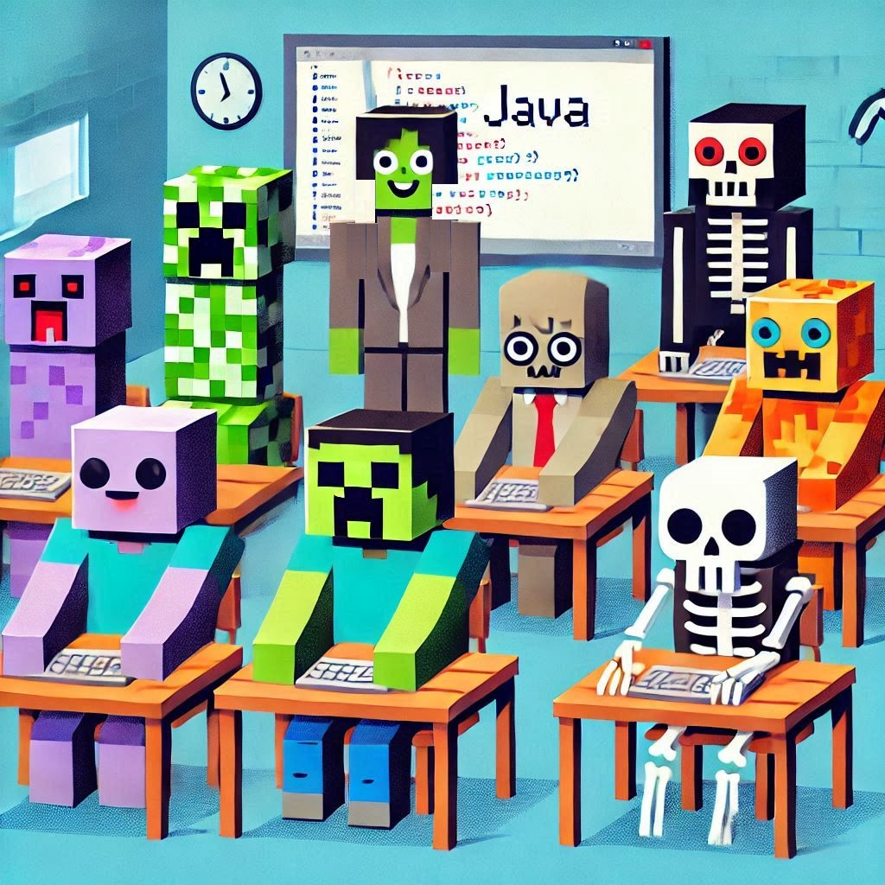

[Adam Sotona](https://github.com/asotona)

# Java Klub Programování

## Kdy, kde, kdo, jak, proč a za kolik?

Scházíme se každý pátek odpoledne od 14:30 v počítačové učebně na základní škole.

Klub je otevřený pro každého studenta (nebo třeba i zaměstnance) školy, koho počítače a programování zajímají.

Spolu si povídáme o různých programátorských nástrojích, učíme se programovat v jazyce Java a vysvětlujeme si různé programy.

Tady postupně přibývá, co už jsme probrali: https://github.com/Java-Klub/Programy

A aby to celé nebyla jenom hrooozná nuuuda, tak v našem klubu vyvíjíme i vlastni modifikace do hry Minecraft (samozřejmě do té originální Java Edition).
V druhé části pak nastartujem vlastní Minecraft server a všechny naše modifikace samozřejmě pořádně otestujeme :wink:

Celé to děláme hlavně pro zábavu, ale vlastně taky pro vzdělání.
Říká se, že kolik jazyků umíš, tolikrát jsi člověkem. A Java je jeden z nejrozšířnější programovacích jazyků na této planetě (a taky trochu i mimo ni).

Za to, že se k nám přidáte do klubu se nic neplatí, nejsme komerční kroužek.
Kdysi jsem navštěvoval podobný kroužek programování, který nakopnul můj zájem a tím i moji kariéru.
Proto je nyní mým potěšením vést tento klub ve stejný stopách.

Pokud si říkáte, že nic není úplně zadarmo, tak máte pravdu. Licence na Minecraft Java Edition stojí cca 400,- až 750,- Kč (podle počasí a nálady toho kterého obchodu).
Aby se mohl každý připojit v druhé části klubu k našemu společnému Minecraft serveru (a abychom neporušovali licenční podmínky hry jako nějací bohapustí piráti), tak musí každý vlastnint jednu licenci hry Minecraft Java Edition.
Pokud už Minecraft Java Edition doma hrajete, tak není vůbec co řešit. A pokud si ji teprve koupíte, tak bude na věky věků Vaše (i mimo klub).

Další penízky si můzete schovat do kasičky na nějaký ten počítač, aby se dalo programovat i doma. V klubu se naučíme i co a jak si nainstalovat.

## Takhle to u nás vypadá

## Odkazy na programy, které v klubu používáme (pro domácí instalaci)
- Apache NetBeans 23 + JDK 23 instalátory: https://www.codelerity.com/netbeans/
- NBM balíček s důležitou aktualizací Apache NetBeans 23 pro náš klub: https://github.com/asotona/netbeans/releases/download/23-update/org-netbeans-modules-java-file-launcher.nbm

## Doporučená literatura (pouze pro velmi vášnivé čtenáře a půlnoční samouky)
- [Pecinovský Rudolf, Pavlíčková Jarmila: Začínáme programovat v jazyku Java](https://www.grada.cz/zaciname-programovat-v-jazyku-java-12200)
